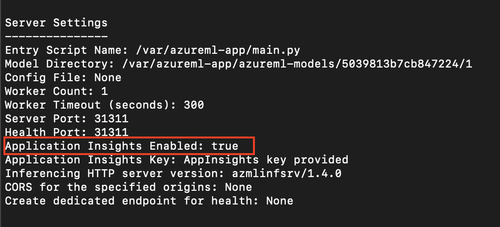
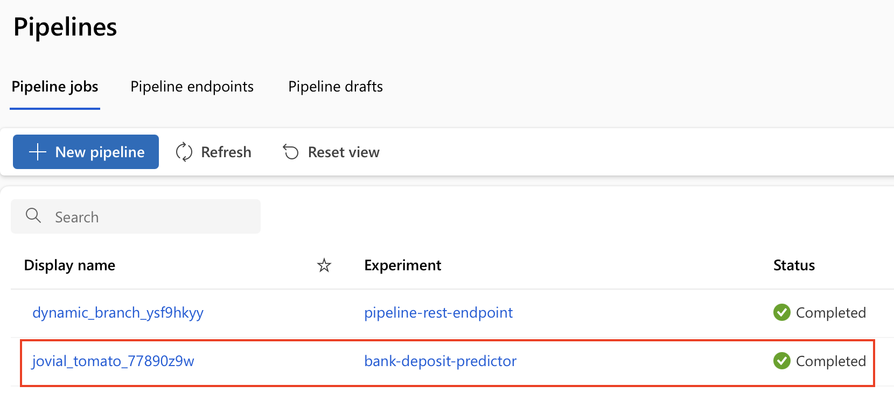
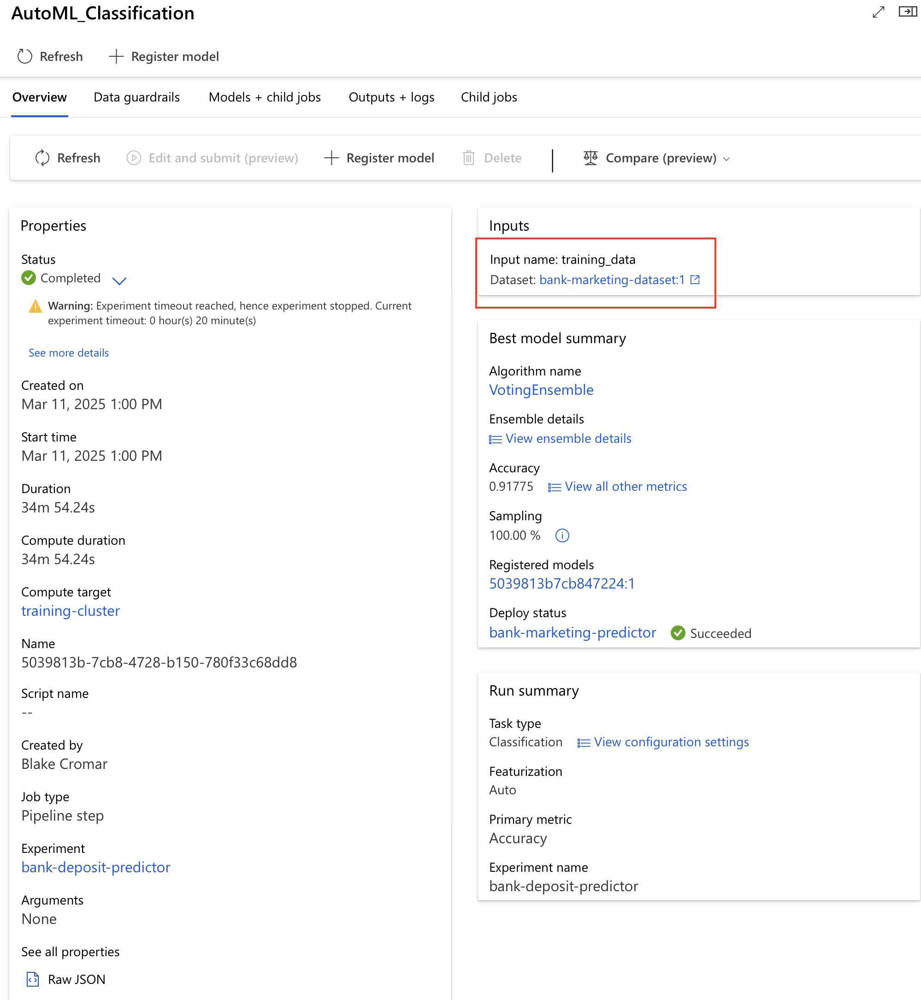
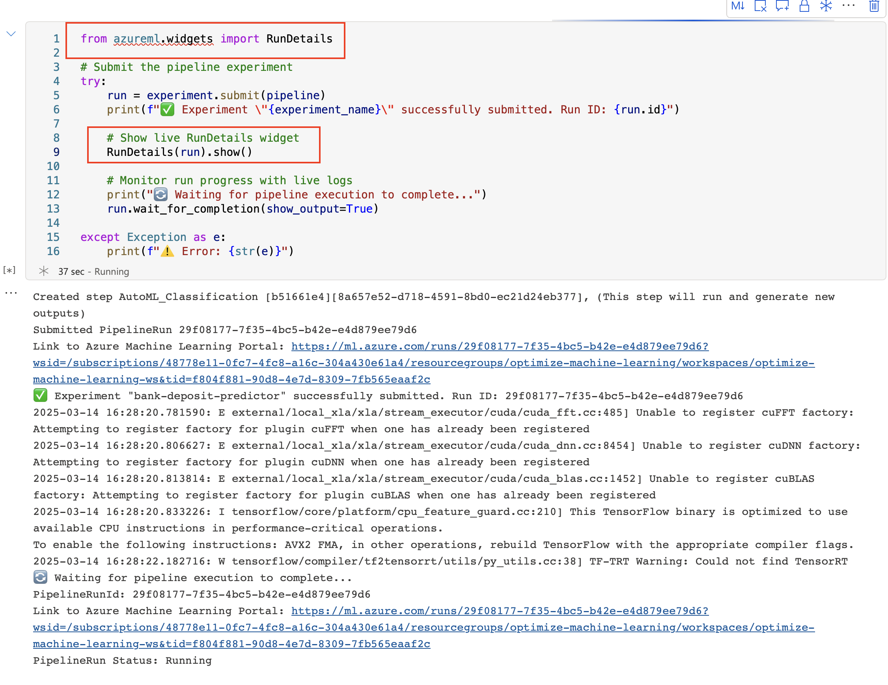

# Optimize Machine Learning - Bank Marketing Predictor

## Project Overview

This project focuses on building, deploying, and monitoring a machine learning model using **Azure Machine Learning Studio** and **Automated ML (AutoML)**. The setup begins with configuring authentication through the **Azure CLI**, installing necessary extensions, and creating a **Service Principal (SP)** with the required permissions. After authentication, an **AutoML experiment** is conducted to train models using the **Bankmarketing dataset** on a cloud-based compute cluster. The experiment optimizes for model performance while considering cost efficiency by adjusting exit criteria, concurrency settings, and early stopping thresholds. Once training is complete, the best-performing model is identified and prepared for deployment.

Deployment is carried out using **Azure Container Instance (ACI)** to expose the model as an API endpoint for real-time inference. **Application Insights** is integrated to monitor performance and collect logs, ensuring visibility into model behavior. **Swagger UI** is then used to interact with the API, test endpoints, and validate predictions. Performance benchmarking is conducted using **Apache Benchmark (ab)** to measure response times and API throughput. Additionally, the end-to-end **ML pipeline** is automated using the **Azure ML Python SDK** within a Jupyter Notebook, streamlining dataset management, training, and deployment. Future improvements include implementing **automatic retraining triggers** and refining **early-stopping criteria** to further enhance model performance and efficiency.

## Architectural Diagram


## Key Steps

### 1. Authentication

To interact with Azure Machine Learning Studio, it is necessary to configure the Azure CLI (az) and install the required extensions. The following key steps were completed to set up the environment:

#### Azure CLI Installation & Authentication

- Installed the Azure CLI (az) and enabled it in the terminal.

-  Successfully logged into Azure using az login.

#### Azure Machine Learning Extension Installation

- Installed the Azure Machine Learning extension to enable interaction with Azure ML Studio.

#### Creating a Service Principal (SP)

- A Service Principal (SP) was created and associated with the designated workspace.

- The SP was granted the necessary permissions for workspace access.


#### Workspace Sharing & Verification


- The `az ml workspace share` command couldn't be run as it's no longer a command that can be run with the current version of the Azure CLI.
- Instead of using the share command to verify this I ran `az role assignment list` to verify the service principal has the role of a contributor. Take note that the principal has an `SP_ID` of `18992d81-3ec6-4aee-9c71-fc6a390df4d7`. 


### **2. Automated ML Experiment**  

To build and evaluate a machine learning model, an **Automated ML (AutoML) experiment** was set up using Azure Machine Learning Studio. The following key steps were completed:  

#### **Dataset Upload & Experiment Setup**  
- The **Bankmarketing dataset** (`bank-marketing_dataset.csv`) was uploaded to Azure ML Studio.  
- A **new Automated ML run** was created to train and test different models.


#### **Compute Cluster Configuration**  
- A **new compute cluster** was configured using `Standard_D3_v2` as the Virtual Machine size.  
- The **minimum number of nodes** was set to 0. I chose 0 instead of 1 as to save money when the cluster wasn't actively running.  


#### **Running the AutoML Experiment**  
- The **Classification task** was selected.  
- The **"Explain best model"** option was enabled for interpretability.  
- The **exit criterion** was reduced from 3 hours to **20 minutes**. This was to save both time and money. 
- The **concurrency** was set to **5** to optimize performance.  


#### **Results & Best Model Selection**  
- Once the experiment completed, the **best-performing model** was identified.  
- Performance metrics were reviewed to determine the most suitable model for deployment.  


This setup ensures an automated and efficient way to train and evaluate machine learning models, minimizing manual tuning efforts.

### **3. Deploying the Best Model**  

After the **Automated ML experiment** is completed, the **best-performing model** is selected based on evaluation metrics. The model is then deployed as an API endpoint for real-time inference.  

#### **Model Selection & Authentication**  
- The **best model** was identified from the **Details** tab in Azure ML Studio.  
- Authentication was enabled to secure access to the model.  

#### **Model Deployment using Azure Container Instance (ACI)**  
- The model was deployed as a web service using **Azure Container Instance (ACI)**.  
- This allows interaction with the model via HTTP API endpoints, enabling **POST requests** for inference.  

This deployment ensures that the model is accessible for real-time predictions, making it easy to integrate into applications.

### **4. Enabling Application Insights**  

After deploying the **best model**, **Application Insights** is enabled to monitor the model’s performance and retrieve logs. This step ensures visibility into the deployed model’s behavior and helps diagnose issues.  

#### **Setting Up Application Insights**  
- Verified that the **Azure CLI (`az`)** and the **Python SDK for Azure** were installed.  
- Created a **new virtual environment** with Python 3 to manage dependencies.  
- Wrote and executed code to enable **Application Insights** for the deployed model.  
 
  

#### **Retrieving Logs**  
- Used the provided `logs.py` script to **fetch and view logs** from the model endpoint.  
- Confirmed that logs were successfully retrieved and displayed.  

 
  

This setup ensures that model performance is monitored in real-time, providing insights into API usage, errors, and latency.

### **5. Consuming the Deployed Model Using Swagger**  

Once the model is deployed, **Swagger** is used to interact with the API, test its endpoints, and visualize the available HTTP methods. This ensures the model is accessible and can be queried programmatically.  

#### **Downloading & Setting Up Swagger**  
- Retrieved the **Swagger JSON file (`swagger.json`)** from the **Azure ML Endpoints section**.  
- Placed `swagger.json` in the same directory as the server script.  

#### **Running the Swagger UI**  
- Executed `swagger.sh` to **download and start the Swagger container** (by default on port **80**).  
- Started a **local HTTP server** using `serve.py` on **port 8000** to serve `swagger.json`.  

**Command to run the server:**  
```bash
python3 serve.py
```

#### **Interacting with the API**  
- Opened **Swagger UI** in a web browser at:  
  ```
  http://localhost:8000
  ```
- Explored the **API documentation**, including endpoints, request methods, and expected responses.  
- Sent test **POST requests** to interact with the model.  

**Screenshot of API methods in Swagger:**  
  

This step ensures the model is accessible via a REST API and can be consumed programmatically for inference.

### **6. Querying the Deployed Model and Performance Benchmarking**  

After deployment, the model is tested by sending requests to its **HTTP API endpoint** to verify that it provides predictions. Additionally, an **optional benchmarking step** using Apache Benchmark can be performed to evaluate its performance.  

---

#### **Interacting with the Deployed Model**  
- Retrieved the **scoring URI** from the **Details tab** in Azure ML Studio.  
- Updated the `endpoint.py` script to include:
  - The **correct scoring URI**.
  - The **authentication key** for the service.  

- Executed the script:
  ```bash
  python3 endpoint.py
  ```
- Verified that the API returned a **JSON response with predictions**.

**Screenshot of API response:**  
 

---

#### **Performance Benchmarking (Optional)**  
To measure response times and performance, **Apache Benchmark (ab)** was used.  

1. **Installed Apache Benchmark** (if not already installed):  
   ```bash
   brew install apache2-utils          # macOS
   ```
2. **Updated `endpoint.py`** with the correct key and URI again.  
3. **Ran `endpoint.py` to generate `data.json`**:  
   ```bash
   python3 endpoint.py
   ```
4. **Executed the benchmarking script**:  
   ```bash
   bash benchmark.sh
   ```
5. **Analyzed response times and API throughput**.

**Screenshot of Apache Benchmark results:**  
  

This step ensures that the deployed model is functional and provides an **efficient response time** when handling API requests.

### **7. Running and Verifying the ML Pipeline**  

This step involves executing a **Jupyter Notebook** that leverages the **Azure ML Python SDK** to automate model training and deployment using pipelines. The pipeline streamlines the end-to-end workflow for managing datasets, training models, and deploying them.  

---

#### **Setting Up and Running the Notebook**  
- **Made my own Custom Jupyter Notebook that is similar as**:  
  ```
  aml-pipelines-with-automated-machine-learning-step.ipynb
  ```
  to **Azure ML Studio**.  

- **Updated the environment variables** in the notebook to match the specific workspace setup.  
- Ensured that `config.json` was downloaded and placed in the **current working directory**.  
- Executed all notebook cells to **initialize and run the pipeline**.  

---

#### **Pipeline Verification in Azure ML Studio**  
- Confirmed that the **pipeline was successfully created** and appeared in the **Pipelines** section of Azure ML Studio.  
- Verified that the **pipeline was scheduled to run or currently running**.  


---

#### **Capturing Key Pipeline Artifacts**  
To document the pipeline execution, screenshots were taken of the following:  
#### **Captured Pipeline Artifacts**  

##### **The Pipelines Section in Azure ML Studio (Pipeline Created)**  
  

##### **The Pipelines Section in Azure ML Studio (Pipeline Endpoint)**  
  

##### **The Bankmarketing Dataset with the AutoML Module**  
  

##### **The Published Pipeline Overview (REST Endpoint & ACTIVE Status)**  
  


##### **The Scheduled Run Appearing in ML Studio**  


## Screen Recording
A video describing this project can be found here:
[YouTube Presentation](https://youtu.be/dYU5CJc9E6E)

## Future Improvements
The model has already demonstrated significant success; however, there are two areas I would like to explore further in the future:

**Implementing a More Robust Retraining Schedule:** Establishing a mechanism that triggers model retraining based on predefined conditions, such as a set time interval or changes in the dataset.

**Adjusting Early-Stopping Criteria:** Relaxing early-stopping thresholds both at the individual algorithm level and for the overall experiment duration. Extending the total runtime to approximately two hours could yield more meaningful results.


## **Note on the RunDetails Widget in Jupyter Notebook (Step Execution Confirmation)**
⚠️⚠️**There seems to be a major error with the RunDetails widget** ⚠️⚠️ 

I utilized the exact code as suggested by the **Udacity instructor.** [The webpage suggested](https://learn.microsoft.com/en-us/python/api/azureml-widgets/azureml.widgets.rundetails?view=azure-ml-py) using this code:
```
   from azureml.widgets import RunDetails

   RunDetails(remote_run).show()
```

The below images shows that I used that implemented the suggested code code on the official Microsoft Website:




I also checked and it seems that the `Python 3.8 - AzureML` environment is what is needed. I confirmed that I am using that.


I installed many things including what the suggested webpage instructed. Here is an image of some of what I tried installing.


### Assessment on the Widget
I'm not entirely sure why the widget is not rendering. I've had this issue before which is why I resorted to printing the details previously when I made the original submission. This widget doesn't seem compatible with `SDK v2` either after looking it up online. Some people online have also had trouble rendering the widget apparently. I have also tried many other things involving installing many other things the internet has suggested installing to render the widget. It will not show up. 

If you look closely at the image of the code I used to run the experiment you can see that the import is underlined. It's odd as the system doesn't break when I run the cell. I took note of that, but can't explain why I'm seeing this anomaly despite uninstalling, updating, and installing various packages.

I would like to show you that I got this particular capability of Azure ML Studio running (though not rendering) and that I have enough evidence to believe there is some sort of conflict with either the Azure ML Studio or the package itself. While it may not be what Udacity is looking for my assessment on the widget is what I have to present instead. 
